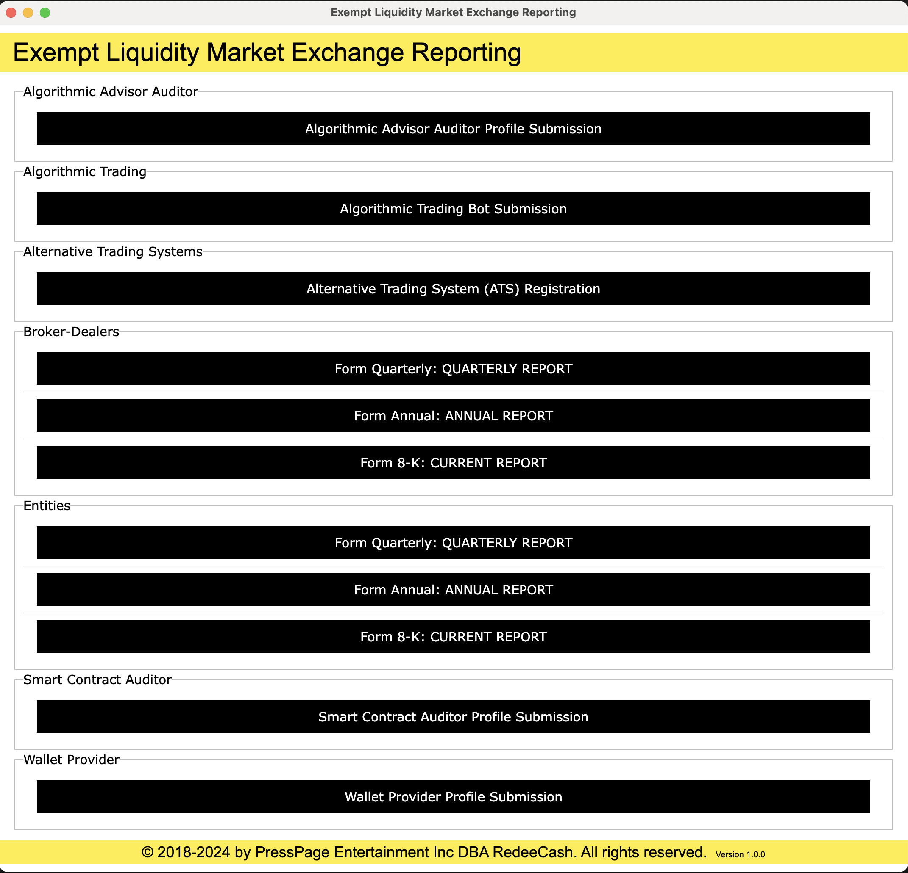

# Data Repository for the Non-reporting Entities

If you are an issuer with an existing SEC exempt offering under regulation D, regulation A tier 1 or a non-reporting interstate offering, you can now provide quarterly and annual reporting to your investors and potential investors.

You will need an SEC issued CIK code and the SEC issued file number for each exempt offering, when applicable.

Resales are subject to reporting requirements

## Report Generation

A report generation application is provided in this repository for your convenience and the complated reports are then submitted through [https://portal.exemptliquiditymarket.exchange.](https://portal.exemptliquiditymarket.exchange.)

## Conflicts in Rules and Regulations with The Authority (aka US Code)

As outlined in the *Administrative Procedure Act (APA)* (5 U.S.C. § 551 et seq.) and case law surrounding administrative agency authority. Specifically, the APA provides the rules and procedures agencies must follow, including the requirement that agency regulations not conflict with statutory authority, which is set forth in the U.S. Code or the Code of Federal Regulations (CFR).

Here's a brief breakdown of relevant principles:

1. **Statutory Authority Requirement**:

   - Agencies cannot create rules that exceed their statutory authority. Under the APA, if a rule goes beyond what Congress authorized, it is invalid. This principle is often referenced through *Chevron deference*, which instructs courts to defer to agency interpretations of ambiguous statutes as long as they are reasonable (see *Chevron U.S.A., Inc. v. Natural Resources Defense Council, Inc.*, 467 U.S. 837 (1984)).
2. **Judicial Review of Agency Actions**:

   - Under *5 U.S.C. § 706*, courts may set aside agency actions that are “arbitrary, capricious, an abuse of discretion, or otherwise not in accordance with law,” or “in excess of statutory jurisdiction, authority, or limitations.”
3. **Regulations Conflicting with U.S. Code or CFR**:

   - If an agency rule conflicts with its authorizing statute in the U.S. Code, or if a conflict arises within the CFR due to unauthorized rule-making, the rule is invalidated upon judicial review. This can be challenged in court, and the reviewing court may strike down rules or regulations that conflict with federal statutes or exceed agency authority.

These provisions ensure that agency rules align with statutory authority without conflicting with the U.S. Code or other regulatory provisions.

## Resales of Exempt Offerings

# Laws that Govern the Securities Industry

See [https://www.sec.gov/about/about-securities-laws#secact1933](https://www.sec.gov/about/about-securities-laws#secact1933)

# The 2000 Shareholder limit does not apply for exempt offerings

The 2,000 shareholder limit does not apply to shareholders obtained from an exempt offering. Since only exempt offerings are listed on the exchange, this limit does not apply, as stated (**bold**) in [Section 78l(g)(1)(A),](https://uscode.house.gov/view.xhtml?req=granuleid:USC-prelim-title15-section78l&num=0&edition=prelim) "within 120 days after the last day of its first fiscal year ended on which the issuer has total assets exceeding $10,000,000 and a class of equity security (**other than an exempted security**) held of record by eithe" Additionally under [Section 78l(g)(2)(A)](https://uscode.house.gov/view.xhtml?req=granuleid:USC-prelim-title15-section78l&num=0&edition=prelim) also exempts the 2000 investor limit when the offerings are listed on a NMS exchange like EXEMPT LIQUIDITY MARKET EXCHANGE (ELMX) as stated, "(2) The provisions of this subsection shall not apply in respect of— (A) any security listed and registered on a national securities exchange."

# Registration Requirements for listing on EXEMPT LIQUIDITY MARKET EXCHANGE (ELMX)

In accordance with 78l(b)(1) the following minimum information is required from all issuers,

    (A) the organization, financial structure, and nature of the business;

    (B) the terms, position, rights, and privileges of the different classes of securities outstanding;

    (C) the terms on which their securities are to be, and during the preceding three years have been, 
    offered to the public or otherwise;

    (D) the directors, officers, and underwriters, and each security holder of record holding more than 
    10 per centum of any class of any equity security of the issuer (other than an exempted security), 
    their remuneration and their interests in the securities of, and their material contracts with, 
    the issuer and any person directly or indirectly controlling or controlled by, or under direct or 
    indirect common control with, the issuer;

    (E) remuneration to others than directors and officers exceeding $20,000 per annum;

    (F) bonus and profit-sharing arrangements;

    (G) management and service contracts;

    (H) options existing or to be created in respect of their securities;

    (I) material contracts, not made in the ordinary course of business, which are to be executed in whole or 
    in part at or after the filing of the application or which were made not more than two years before such filing, 
    and every material patent or contract for a material patent right shall be deemed a material contract;

    (J)**NOT REQUIRED BUT RECOMMENDED**. balance sheets for not more than the three preceding fiscal years, 
    certified if required by the rules and regulations of the Commission by a registered public accounting firm;

    (K)**NOT REQUIRED BUT RECOMMENDED.** profit and loss statements for not more than the three preceding fiscal years, 
    certified if required by the rules and regulations of the Commission by a registered public accounting firm; and

    (L)**NOT REQUIRED BUT RECOMMENDED**. any further financial statements which the Commission may deem necessary 
    or appropriate for the protection of investors.
