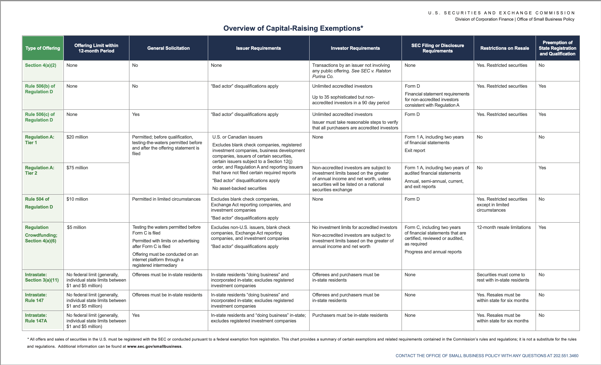

# Data Repository for the Non-reporting Entities

If you are an issuer with an existing SEC exempt offering under regulation D, regulation A tier 1 or a non-reporting interstate offering, you can now provide quarterly and annual reporting to your investors and potential investors on a voluntarily basis without the need for an audit.

You will need an SEC issued CIK code and the SEC issued file number for each exempt offering, when applicable.

Submit your annual and quarterly reports from your dashboard at [https://redeecash.exchange](https://redeecash.exchange).

Resales are subject to reporting requirements

## Resales of Exempt Offerings

# Laws that Govern the Securities Industry

See [https://www.sec.gov/about/about-securities-laws#secact1933](https://www.sec.gov/about/about-securities-laws#secact1933)

# The 2000 Shareholder limit does not apply for exempt offerings

The 2,000 shareholder limit does not apply to shareholders obtained from an exempt offering. Since only exempt offerings are listed on the exchange, this limit does not apply, as stated (**bold**) in [Section 78l(g)(1)(A),](https://uscode.house.gov/view.xhtml?req=granuleid:USC-prelim-title15-section78l&num=0&edition=prelim) "within 120 days after the last day of its first fiscal year ended on which the issuer has total assets exceeding $10,000,000 and a class of equity security (**other than an exempted security**) held of record by eithe" Additionally under [Section 78l(g)(2)(A)](https://uscode.house.gov/view.xhtml?req=granuleid:USC-prelim-title15-section78l&num=0&edition=prelim) also exempts the 2000 investor limit when the offerings are listed on a NMS exchange like REDEECASH EXCHANGE as stated, "(2) The provisions of this subsection shall not apply in respect of— (A) any security listed and registered on a national securities exchange."
